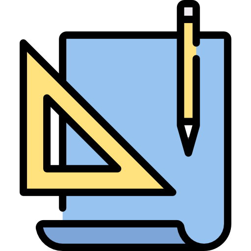
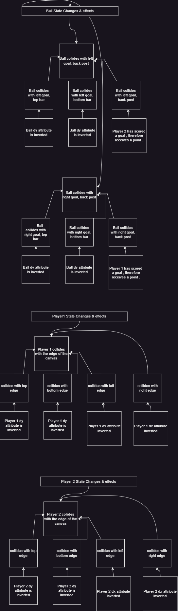
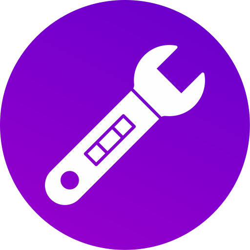

# 2d_Rocket_League

# Documentation
This is my implementation of a 2D version of Rocket League.  
Please click [HERE](https://frantic-pocketbook-seal.cyclic.app/) to take a look.

## Technical Documentation 

For each class or file used here is the functional documentation:

* [Main.js](public/documentation/Main.md)
* [Sprite.js](public/documentation/Sprite.md)
* [GoalPost.js](public/documentation/GoalPost.md)
* [Scene.js](public/documentation/Scene.md)
* [Car.js](public/documentation/Car.md)
* [Ball.js](public/documentation/Ball.md)
* [Keyboard.js](public/documentation/Keyboard.md)
* [Mouse.js](public/documentation/Mouse.md)

# Game Design 

### Overview
In this game there really only is one scene, the main scene. For this reason I decided to encapsulate this   inside the file main.js. Hence the name main. In the main scene we will first initialize all our   class instances globally using the var keyword. I am doing this because I am initializing all   instances in the function `init()`, therefore I would like them to be available globally.   
Here is a list of all the classes Ill be using in game:
* GoalPost.js
* Car.js
* Ball.js

Since `Main.js` has been covered already, I will now explain the rest. Lastly no game object dies, due 
to the nature of Rocket League.

### GoalPost.js
Encapsulates all the functionality of a goal post in a rocket league match. There will be two instacnce   
of the `GoalPost` class. The first will represent the left goal post, the second will represent the right  
goal post. Furthermore, `player1` will be assigned to the left goal post, and `player2` will be assigned to the  
right. When a player is assigned to a goal post they are in charge of defending the goal post. If the ball hits  
the back of their goal post, the other player will recieve a point. The points are refreshed during every itteration   of the game loop. Lastly, the goal post is designed in a tree like structure, but without the recursive nature.   Instead I've decided to contructing using three subclasses on the heap.

Here are the encapsulated functionalities:
* Initializing the given goal net.
* Stop itself from mooving
    * This is necissary because the back post of the goal will be rotated.
    * Once rotated, it's dy will cause it to move. To stop this I've made  
    the dy factor so small that its basically 0. I didn't set it to 0 because  
    0/0 leads to undefined behavior. 
    * However there is no issue in setting dx to 0, therefore dx is 0.
* Handle collisions with any one of the three sides of the goal post.
    * If there is a collision with the top or bottom, the other sprite should bounce.
    * If there is a collision witht the back post, we then know that the opposing  
    player scored a goal. Therefore, we will update the score and reset the player positions.

All of the above functionality will be abstracted away in the `update()` function.

### Car.js
Encapsulates all the fucntionalities of a car in Rocket League. Furthermore, is  
a child of the `Sprite` class, which allows it to inherit a lot of usefull features  
from the `Sprite` class. These faeatures include:  
* Collision Detection
* Affine Transformations
* Image Encapsulation

With these usefull inheritence the only custom functionality needed is a way to control the  
car. Depeninding on which player you want to control, the controls will differ.  
Here are the controls:  
 

* Player 1
    * `W`: Go forward.
    * `S`: Stop or go backward.
    * `D`: Turn right.
    * `A`: Turn Left.
 

* Player 2
    * `UP Arrow`: Go forward.
    * `Down Arrow`: Stop or go backward.
    * `Right Arrow`: Turn right.
    * `Left Arrow`: Turn Left.
 

When a collision occures between a ball and a car, the collision will be handled  
in the `Ball` class. Furthermore, I've decided to check for collisions only between:
 

* Ball Vs player
* Ball Vs goal post.
This is because, due to the reactive nature of the ball, there might be a loop of  
collisions if we also check for car to car collisions. To avoid a possible loop, and  
maximize game performance there is no collision detection between two cars.  

Another challenging issue is having a larger screen. If the dimensions of the canvas  
exceed 1000 pixels in width, we start to have the following issues:
* Not gurenteed to have a constant canvas size.
    * Might have to use css to dynamically adjust the canvas size.
* Significant imapact to game play performance, depending on the device's graphic resources.

For the above reasons, I've decided to stick with a maximum width of 900 pixels. I  
believe this will provide substancial space, without a noticeble difference on performance.  
For refference this is all based on performance output from my local machine.  

To make the game more fun, the goal posts wont collide with a player.  
This means that players can easily move in, and out of the net to intercept a  
goal before it hits the back of the net. 
 

Lastly, the only events that cause a state change to the car class is either:
* User input to change the car's trajectory.
* The car colliding with the borders of the canvas.

### Ball.js
Encapsulates all the functionalities required by a ball in the game. The ball will be  
the most reactive game element in my game. For this reason, I expect the majority of  
collisions to be caused by the `Ball` class.  

Here are the functionalities:
* Bounce 
    * After colliding with another game object the ball will either invert its dx or dy.
* Handle Collisions

Lastly, the state of the ball is only altered when the ball collides with the following:
* The edge of the canvas.
* One of the players.
* One of the goal posts.

# Software Engineering Plan 
* Thursday
    - Map out classes & Relationships
    - Get a general idea of required class behavior.
* Friday
    - Finalize rough sketch for classes.
    - Get a general idea of required state change.
    - Map out potential effects.
* Saturday
    - Implement base classses.
    - Try to have basic functionality working. 
* Sunday
    - Implement ball collision detection.
    - Implement goal posts graphically.
* Monday
    - Finish Goal implementation.
    - Implement goal detection, and handle goal event.
    - Implement score board.
    - Verify game functionality.
* Tuesday
    - Buffer day to handle bugs or to catch up to speed.
    - If game is fully functional, implement a 2 player online lobby.
    - Implement sockets using Socket.io in JavaScript.
* Wednesday
    - Resolve any remaining bugs.
    - Finalize documentation.
    - Deploy site.

# State Transition Diagram

# Installation Notes 

Due to the versitile nature of the internet there is hardly anything needed from you the user.  
The only prerequisites are:
- A stable connection just to load the page. Once the page is loaded, an internet connection is   is not necisary.
- A keyboard to interact with the game.

 
Here are the controles for the game. Keep in mind that this is intended to be a two player local 
  game.

* Player 1
    * `W`: Go forward.
    * `S`: Stop or go backward.
    * `D`: Turn right.
    * `A`: Turn Left.
 

* Player 2
    * `UP Arrow`: Go forward.
    * `Down Arrow`: Stop or go backward.
    * `Right Arrow`: Turn right.
    * `Left Arrow`: Turn Left.
 
Unfortunately, I ran out of time and could not implement a 2 player online game lobby. I do plan 
on doing this in the near future. Here are the steps I'll take:
 

- Connect a socket to listen on the current port. ( Already implemented, see Server.js file. )
- Once a user visits the page, I will use Socket.io-client to connect to the instance running on the backend.  
- On every connection the user will be assigned an ID.
    - First player to join will be connected as `player1`.
    - Second player to join will be connected as `player2`.
- Each connection will be stored in a JS array. 
    - Once the array length reaches 2 players, stop accepting connections.
    - This will close the lobby.
- If one of the players disconnect, the lobby will allow another player to join in their place.
- Players can leave at any point in time.

# Credits  &ensp; 
* Icons: 
    * <a href="https://www.flaticon.com/free-icons/document" title="document icons">Document icons created by Freepik Flaticon</a>
* Car Images:
    * <a href="https://stock.adobe.com/Library/urn:aaid:sc:US:d7f9259d-5e63-427c-823d-a217f93a4126?asset_id=281630869">Licensed from Adobe Stock</a>
* Soccer Ball:
    * <a href="https://stock.adobe.com/Library/urn:aaid:sc:US:d7f9259d-5e63-427c-823d-a217f93a4126?asset_id=281630869">Licensed from Adobe Stock</a>

# Custom Assets:
* Goal Post Images

# Thanks For Stopping By 😎